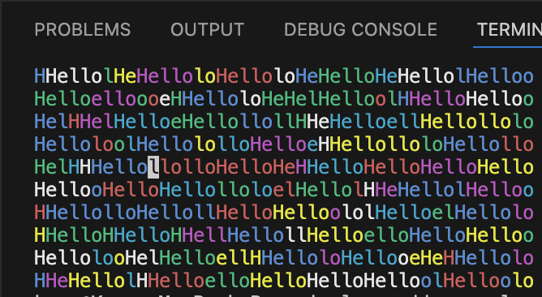
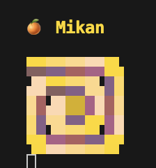
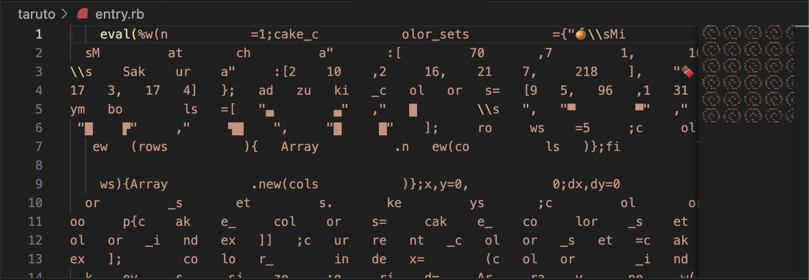

# code-party-2025-TRICK

This repository documents my explorations during the RubyKaigi 2025 Code Party, focusing on the TRICK, Reline, and IRB group led by tompng!

- Began with an introduction to basic ASCII art syntax, guided by tompng san. ([See examples](simple_ascii_examples)). 🐣 (Special thanks to Tada san for the assistance during this phase!)
    > Crazy 'Hello's

    > 
- Examined some award-winning TRICK entries and observed common techniques ...
  - MATH!!! 😱
    - Lissajous curves were used in the [Best Fishbowl by tompng](https://github.com/tric/trick2022/blob/master/01-tompng/entry.rb) to create the 3D-like swimming animation of fish.
    - Bezier curves were likely used in the [Most Natural flowers by beta_chelsea](https://github.com/tric/trick2025/blob/main/08-beta_chelsea/entry.rb) to shape smooth, natural-looking petals.
  - For Quines, a common pattern involves using `%w` followed by `*""` to format the source code itself into meaningful images.
- Then we tried to get our hands dirty 💪
  - I literally had no idea in the beginning... Yamashita-san drew inspiration from the Matsuyama specialty 'taruto' on the table and attempted to draw a spiral. Inspired by this, I also tried creating various flavors of taruto. Although the code is quite messy, I experimented with arranging the code itself into a visual pattern (it became clear that writing some automation tools would be beneficial, as manual arrangement is very time-consuming).
    > One of the taruto I made ~ Mikan flavor! 🍊
    > Please run [taruto/entry.rb](taruto/entry.rb) to see more flavors 🙈

    > 
    > 
